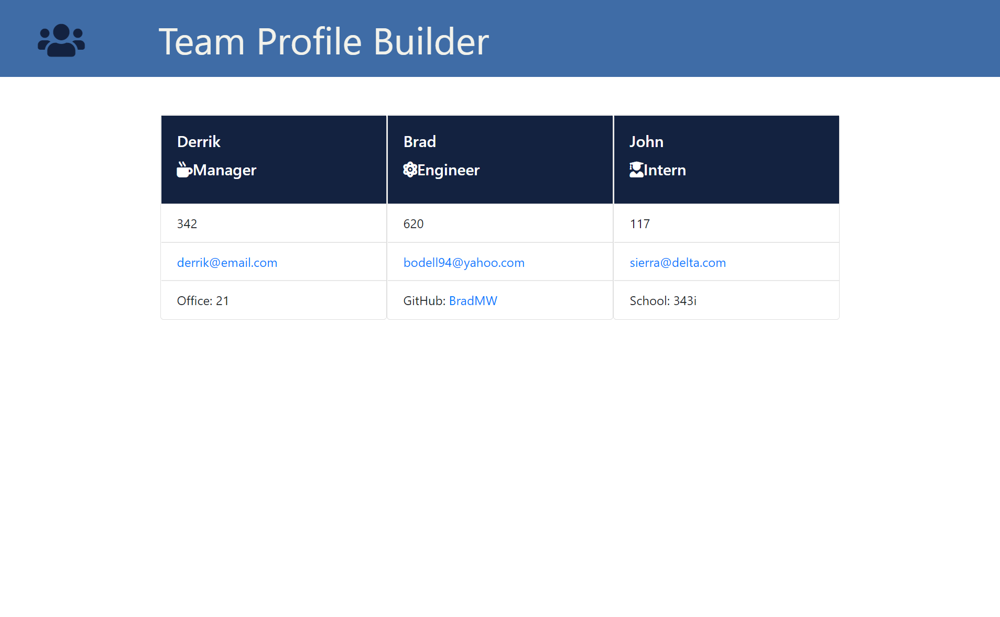

# Team Profile Generator

 ## Description
  This is a team profile generator. You can build out a list of employees by filling out some information.

 ## Table of Contents
  - [Insallation](#installation)
  - [Usage](#usage)
  - [Credits](#credits)
  - [License](#license)

 ## Installation
  You will want to run npm i and then open the index.js file into a terminal by doing node index.js. Once you run that command you will be asked a few questions.

 ## Usage
  This project can be used to create a list of employees with relevent data in their cards. Once you have added all of the employee types you need, the project will open a new HTML document. Open that document in your default browser and you will be greated by a clean webpage with individual cards for each employee. Each of these cards will show relevent data such as their ID, email, github, name, and office number if applicable.

 ## Credits
  [BradMW](https://github.com/BradMW)

 ## License
  

 ## Features
  This Team Profile Generator will take in user input and create a dynamic HTML page that will display the information. This generator also has test files to make sure everything will run correctly. 

Link to a video of the team generator in action:
https://drive.google.com/file/d/1SOEC0Z9C_F-F5dN0NmIYags2PZRd6s9O/view

  
